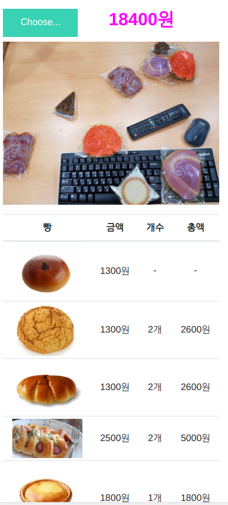
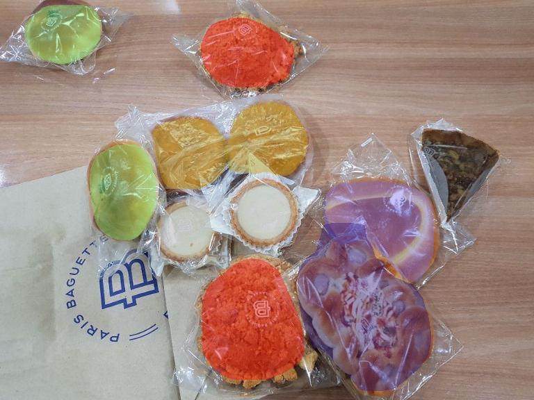

# Pantheon (bread-scanner)

## Introduction

Pantheon is bread price scanner with Mask RCNN. We developed a program to recognize the kind of bread and calculate the price. At first, only 6 Paris Baguette bread was made, and 184 of the total 185 pieces of bread were matched to achieve the accuracy of 99.45%. We build a simple website and shoot within our smartphone.

The project name is Pantheon, which is inspired by the character of the game, LOL.

The basic procedure of development is the same as the previous [sushi dish detection](https://github.com/blackrubystudio/Sushi-dish-detection), we added the code to calculate the accuracy. In the following article, we will simply write down how to upload deep learning model with Python Flask.

    

> Based on Paris Baguette near Gangnam-gu Station, the price of the above bread is about $ 18. 

## Steps 

### TO-DO-1

### TO-DO-2

## Result

    

We measured the accuracy by recognizing only six pre-selected pieces of bread. With some photos that unsupported bread was included, We completed 184 of 185 pieces of bread and achieved the accuracy of 99.45% and finished the project.

We shut down the server now, but we would like to show you if you send us an email(info@blackrubystudio.com). If we are formally working on this project, we will be pushing towards support more bread or recognizing other kinds of things.
